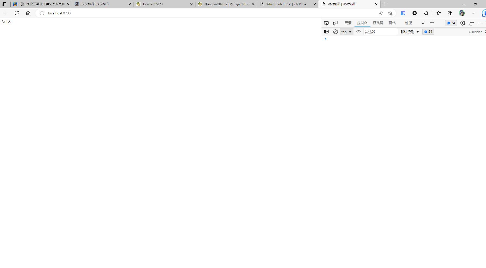

https://zhuanlan.zhihu.com/p/522093254

# 自定义主题技术留档

## day-01

### prettier、tsconfig、vite.config、tailwindcss 配置

1. prettier

   - 安装

     ```bash
     yarn add prettier -D # prettier相关
     ```

   - 配置.prettierrc

     ```js
     module.exports = {
       tabWidth: 2,
       semi: false,
       trailingComma: 'none',
       singleQuote: true,
       printWidth: 120,
       arrowParens: 'always',
       bracketSpacing: true,
       endOfLine: 'auto',
       useTabs: false,
       quoteProps: 'as-needed',
       jsxSingleQuote: true,
       jsxBracketSameLine: false,
       rangeStart: 0,
       rangeEnd: Infinity,
       requirePragma: false,
       insertPragma: false,
       proseWrap: 'never',
       htmlWhitespaceSensitivity: 'css'
     }
     ```

2. vite.config.ts

   - 安装

     ```bash
     yarn add vite -D # vite相关
     ```

   - 配置

     ```ts
     import { defineConfig } from 'vite'
     import { resolve } from 'path'
     import { fileURLToPath } from 'url'

     export default defineConfig({
       server: {
         port: 3000
       },
       resolve: {
         alias: {
           // 配置路径别名
           '@': fileURLToPath(new URL('./docs/.vitepress', import.meta.url))
         }
       },
       plugins: []
     })
     ```

3. tsconfig

   - 初始化

     ```bash
     npx tsc --init
     ```

   - 配置

     ```json
     {
       "compilerOptions": {
         "module": "ESNext",
         "baseUrl": ".",
         "target": "es2016",
         "lib": ["DOM", "ESNext"],
         "strict": true,
         "esModuleInterop": true,
         "skipLibCheck": true,
         "noUnusedLocals": true,
         "moduleResolution": "node",
         "resolveJsonModule": true,
         "strictNullChecks": true,
         "forceConsistentCasingInFileNames": true,
         "types": ["vite/client", "node"]
       },
       "include": ["./*.ts", "./.vitepress/**/*.ts", "./.vitepress/**/*.vue"],
       "exclude": ["**/dist/**", "node_modules"]
     }
     ```

4. tailwindcss

   - 安装

     ```bash
     yarn add @tailwindcss/postcss7-compat autoprefixer postcss -D
     ```

   - 创建配置文件并修改配置

     `npx tailwindcss init -p`

     ```js
     /** @type {import('tailwindcss').Config} */
     module.exports = {
       // - purge:{...}
       // + content:[...]
       content: ['./docs/.vitepress/**/*.{js,ts,vue}', './docs/**/*.md'],
       darkMode: 'class', // or 'media' or 'class'
       theme: {
         extend: {}
       },
       variants: {
         extend: {}
       },
       plugins: []
     }
     ```

   - 使用

     在主题入口文件引入`tailwindcss`

     ```typescript
     import Theme from '../theme-default/index'
     import './tailwind.postcss'

     export default {
       ...Theme
     }
     ```

     提示缺少 `tailwind.postcss` 文件，新建文件并修改内容

     ```postcss
     @tailwind base;

     @tailwind components;

     @tailwind utilities;
     ```

5. 创建自定义主题空工程

   - 当前的目录结构为

     ```diff
     |-- blog
         |-- ...other file
         |-- demo
             |-- .vitepress
             |   |-- config.ts # blog's configuration
             |   |-- theme
             |   |   |-- index.ts # theme entry
             |   |   |-- pages
             |   |   |   |-- Layout.vue # layout file
             |   |   |   |-- NotFound.vue
             |   |   |-- |components
             |   |   |   |-- ...vueComponents
         |-- tsconfig.json
         |-- vite.config.ts
         |-- tailwind.config.js
         |-- postcss.config.js
         |-- .prettierrc.js
         |-- env.d.ts
     ```

   - 自定义主题的优先级会高于默认主题，如果在 `.vitepress`下新建了 `theme`文件，那么就会覆盖默认主题

6. 创建 theme 主题，并在里面导出`theme`

   - index.ts

     ```ts
     import { Theme } from 'vitepress'
     import Layout from './pages/Layout.vue'
     import NotFound from './pages/NotFound.vue'
     import './styles/index.less'

     const theme: Theme = {
       Layout,
       NotFound,
       enhanceApp({ app, router, siteData }) {}
     }

     export default theme
     ```

   - pages/Layout.vue

     ```vue
     <script lang="ts" setup></script>

     <template>
       <div>123123</div>
     </template>

     <style></style>
     ```

   - pages/NotFound.vue

     ```vue
     <script lang="ts" setup></script>

     <template>
       <div>404</div>
     </template>

     <style></style>
     ```

   - env.d.ts

     ```ts
     /// <reference types="vitepress/client" />

     declare module '*.vue' {
       import { DefineComponent } from 'vue'
       const component: DefineComponent<{}, {}, any>
       export default component
     }
     ```

7. 在上面的全部配置完毕之后，在 `package.json` 中，配置启动脚本，测试一下刚才的配置是否全都成功

   ```json
   {
     "scripts": {
       "dev": "vitepress dev demo",
       "build:docs": "vitepress build demo",
       "serve": "vitepress serve demo"
     }
   }
   ```

   

   出现以上画面，证明自定义工程已经搭建成功，继续加油吧
