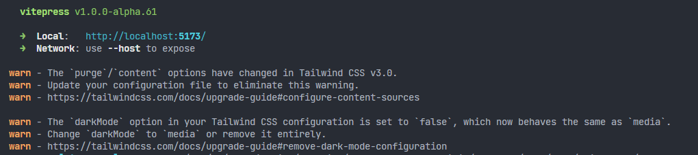
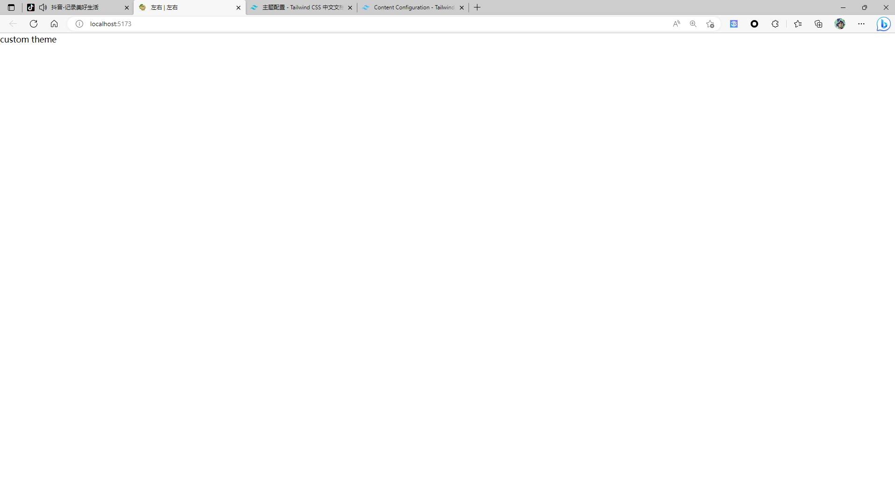

https://zhuanlan.zhihu.com/p/522093254

# 自定义主题技术留档

## day-01

### eslint、prettier、tsconfig、vite.config配置

1. 安装依赖

  ```bash
  yarn add -D
  > eslint eslint-plugin-vue vue-eslint-parser vite-plugin-eslint # eslint相关
  > prettier eslint-config-prettier eslint-plugin-prettier # prettier相关
  > @babel/core @babel/eslint-parser # eslint解析相关

  # vite-plugin-eslint 可以不安装这个包,但在使用yarn dev时并不会主动检查代码
  # eslint-config-prettier // eslint兼容的插件
  # eslint-plugin-prettier // eslint的prettier
  ```

2. eslint 配置

- 执行初始化命令 `npx eslint --init`
- 根据自己喜好选择配置选项
- 安装完成后，根目录出现.eslintrc.js文件

3. 配置vite.config.ts

```json
{
  "compilerOptions": {
    "baseUrl": ".",
    "module": "esnext",
    "outDir": "dist",
    "target": "esnext",
    "moduleResolution": "node",
    "strict": true,
    "jsx": "preserve",
    "esModuleInterop": true,
    "noUnusedLocals": true,
    "lib": [
      "ESNext",
      "DOM"
    ],
    "skipLibCheck": true,
    "allowJs": true,
    "resolveJsonModule": true,
    "paths": {
      "@/*": [
        "./src/*"
      ]
    }
  },
  "include": [
    "src",
    "types"
  ],
  "exclude": [
    "node_modules",
    "dist",
    "node.d.ts"
  ]
}
```

4. 配置 .prettierrc

```js
module.exports = {
  tabWidth: 2,
  semi: false,
  trailingComma: 'none',
  singleQuote: true,
  printWidth: 120,
  arrowParens: 'always',
  bracketSpacing: true,
  endOfLine: 'auto',
  useTabs: false,
  quoteProps: 'as-needed',
  jsxSingleQuote: true,
  jsxBracketSameLine: false,
  rangeStart: 0,
  rangeEnd: Infinity,
  requirePragma: false,
  insertPragma: false,
  proseWrap: 'never',
  htmlWhitespaceSensitivity: 'css'
}
```

5. 配置 .eslintrc.js

```js
module.exports = {
  env: {
    browser: true,
    es2021: true,
    node: true
  },
  extends: [
    'eslint:recommended', // 使用推荐的eslint
    'plugin:vue/vue3-recommended', // 使用插件支持vue3
    // 如果你没有安装第7步,以下两个包不要引入,否则报错
    'plugin:prettier/recommended',
    'eslint-config-prettier'
  ],
  parserOptions: {
    ecmaVersion: 13,
    sourceType: 'module',
    ecmaFeatures: {
      modules: true,
      jsx: true
    },
    requireConfigFile: false,
    parser: '@babel/eslint-parser'
  },
  // eslint-plugin-vue
  plugins: [
    'vue', // 引入vue的插件 vue <==> eslint-plugin-vue
    // 这个包需要安装了第7步的三个包再引入
    'prettier' // 引入规范插件  prettier <==>  eslint-plugin-prettier
  ],
  globals: {
    defineProps: 'readonly',
    defineEmits: 'readonly',
    defineExpose: 'readonly',
    withDefaults: 'readonly'
  },
  // 这里时配置规则的,自己看情况配置
  rules: {
    'import/no-unresolved': 'off',
    semi: 'off',
    trailingComma: 'off'
  }
}
```

### 配置tailwindcss

1. 安装依赖

```bash
yarn add @tailwindcss/postcss7-compat autoprefixer postcss -D
```

2. 创建配置文件并修改内容
   <br>`npx tailwindcss init -p`<br/>
   会在根目录生成 `tailwind.config.js` 文件

```js
// tailwind.config.js
module.exports = {
  purge: [],
  darkMode: false, // or 'media' or 'class'
  theme: {
    extend: {},
  },
  variants: {
    extend: {},
  },
  plugins: [],
}
```

3. 在主题入口`index`文件引入`tailwindcss`

```typescript
import Theme from "../theme-default/index";
import "./tailwind.postcss";

export default {
  ...Theme,
};
```

4. 提示缺少 `tailwind.postcss` 文件，新建文件并修改内容

```postcss
@tailwind base;

@tailwind components;

@tailwind utilities;
```

5. 更新 `purge` 配置

```js
/** @type {import('tailwindcss').Config} */
module.exports = {
  purge: {
    content: [
      "./docs/.vitepress/**/*.js",
      "./docs/.vitepress/**/*.vue",
      "./docs/.vitepress/**/*.ts",
    ],
    options: {
      safelist: ["html", "body"],
    },
  },
  darkMode: false, // or 'media' or 'class'
  theme: {
    extend: {},
  },
  variants: {
    extend: {},
  },
  plugins: [],
};
```

6. 配置到这一步，应该是能在md文件或者vue文件中使用 `tailwindcss` 了，就在启动项目时，终端出现以下警告



大致意思就是，在tailwindcss v3.0版本中，已经将purge选项，修改为了content
现在让我们修改一下配置：

```js
/** @type {import('tailwindcss').Config} */
module.exports = {
  content: ['./demo/.vitepress/**/*.{js,ts,vue}', './demo/**/*.md'],
  darkMode: 'class', // or 'media' or 'class'
  theme: {
    extend: {}
  },
  variants: {
    extend: {}
  },
  plugins: [],
  options: {
    safelist: ['html', 'body']
  }
}
```

> end：到此`tailwindcss`配置就结束

### 创建自定义主题空工程

当前的目录结构为

```
|-- blog
    |-- ...other file
    |-- demo
        |-- .vitepress
        |   |-- config.ts # blog's configuration
        |   |-- theme
        |   |   |-- index.ts # theme entry
        |   |-- theme-default # theme modules folder
        |       |-- index.ts # module entry
        |       |-- Layout.vue # layout file
        |       |-- NotFound.vue
        |       |-- pages
        |       |-- components
        |           |-- ...vueComponents
    |-- tsconfig.json
    |-- vite.config.ts
    |-- tailwind.config.js
    |-- postcss.config.js
    |-- .prettierrc.js
    |-- .eslintrc.js
```

`theme-default`为自定义主题，导出`Layout.vue`，在`theme/index`中导入并使用，为的是主题间的解耦，方便以后换主题成本不这么高

自定义主题的优先级会高于默认主题，如果在 `.vitepress`下新建了 `theme`文件，那么就会覆盖默认主题

1. 创建 `theme-default` 主题文件，并在 `theme-default` 下新建以下文件导出

index.ts

```ts 
import {Theme} from "vitepress";
import Layout from "./Layout.vue";

const theme: Theme = {
  Layout,
  NotFound,
  enhanceApp({app, router, siteData}) {
  },
};

export default theme;
```

Layout.vue

```vue

<script setup lang="ts"></script>
<template>
  <div>
    custom theme
  </div>
</template>

```

shims-vue.d.ts

```ts
//必需export 否则会导致路由找不到文件及main.ts产生错误
export {};

declare module "vue" {
  interface ComponentCustomProperties {
    $frontmatter: any;
  }
}

```

style/global.css

```css
/*
一些公共样式
*/
```

style/tailwind.postcss

```postcss
@tailwind base;
@tailwind components;
@tailwind utilities;
```

2. 在上面的全部配置完毕之后，在 `package.json` 中，配置启动脚本，测试一下刚才的配置是否全都成功

```json
{
  "scripts": {
    "dev": "vitepress dev demo",
    "build:docs": "vitepress build demo",
    "serve": "vitepress serve demo"
  }
}
```



出现以上画面，证明自定义工程已经搭建成功，继续加油吧
