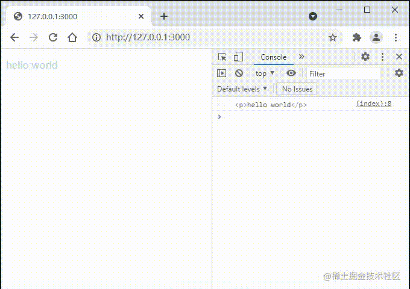
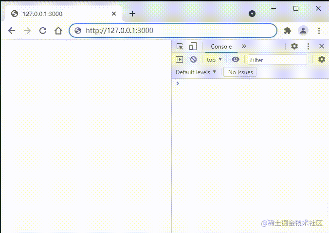
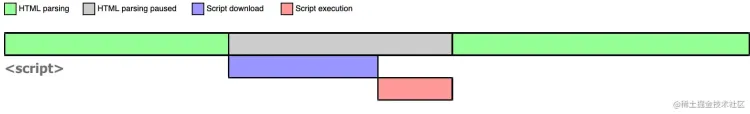
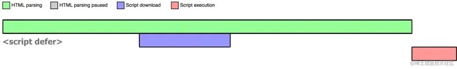
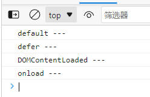
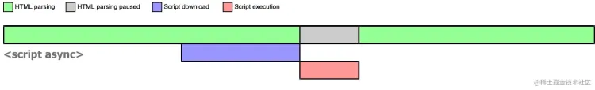
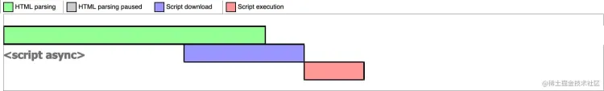

# 浏览器渲染原理

## 前言

在前端的面试中，有一道经典的八股文问题，当我们在地址栏输入 URL 后，这个过程会发生什么？

这篇文章就来了解一下这背后的发生了什么

关于这个答案，一个最极简的回答是：

> 当我们从一个特定的网站请求网页时，浏览器从网络服务器获取特定的资源，然后在我们的客户端上显式该网页。

实际上，当用户在地址栏内输入`URL`按下回车后，浏览器大致会发生以下步骤：

`导航 -> 请求 -> 响应 -> 解析渲染`

## 导航

导航是网页加载的第一步，当用户在地址栏输入内容并按下回车后

1. 浏览器会判断输入的是`url`还是搜索关键字
   - 关键字，会调用浏览器的默认搜索引擎，并跳转搜索
   - `url`，则会进入下一阶段，判断缓存
2. 接下来浏览器会判断输入的网址是否有缓存
   - 有，返回缓存的资源
   - 无，进入下一阶段`DNS域名解析`
3. `DNS域名解析`，获取输入的`URL`对应的网络服务器 IP 地址

**优化手段：**

1. DNS 缓存

## 请求阶段

一旦浏览器知道了服务器的`IP`地址，以`http`协议为例，浏览器会尝试通过 TCP 的三次握手四次挥手，与目标服务器进行链接


1. 与目标服务器建立 TCP 链接
2. 构建请求头、请求体、cookie
3. 发送`http`请求

**优化手段：**

1. 发送请求会影响耗时，当请求多了，耗时也就高了，适当减少 http 请求，能合并请求就合并

## 响应阶段

服务器收到请求后，它会对这个请求进行处理，并回复一个响应信息，此时来到了响应阶段


1. 获取响应体
2. 检查是否存在强缓存、协商缓存
   - 存在缓存，直接使用缓存，进入到渲染阶段
   - 不存在缓存，会下载资源
3. 断开链接，避免客户端、服务器两端的资源占用与损耗，当双方没有发生请求或者响应时，任意一方都可以关闭请求，断开链接

**优化手段：**

1. 检查响应头，建议开启缓存（强缓存、协商缓存）
2. 尽量不要给`HTML`资源添加缓存，避免更新不成功，因为打包工具会给我们的`JS|CSS`资源添加上哈希值在本地开启缓存，如果`HTML`资源也缓存了，就没办法识别到打包工具的缓存，就会造成页面更新不成功

## 解析渲染阶段

到了最重要的阶段，浏览器拿到响应的数据后，会在浏览器内部开辟一块栈内存，给代码执行提供环境，换句话说，浏览器拿到数据后，会开启一个渲染进程去解析、渲染、执行代码、展示等操作，同时在渲染进程内分配一个`JS引擎线程`用于解析（`将JS代码组成AST抽象语法树`）、执行`JS代码`，<span style="background: #786512;color: #fff;">这就是 JavaScript 为什么是单线程的原因，因为浏览器只会在一个进程内分配一个主线程去解析执行 JS 代码</span>

渲染进程自上而下扫描资源（<span style="background: #786512;color: #fff;">代码</span>），并逐行入栈执行，执行完成出栈

在扫描过程中，遇到这些标签`video|img|<link href="..." />|script`，会将它们移交新的线程去加载资源，这个线程就是`Task Queue`任务队列，主线程继续往下执行

### 渲染流程

一个完整的渲染流程如下

- 渲染进程解析`HTML`生成`DOM Tree`
- 解析`CSS`生成`CSSOM Tree`
- 将`DOM Tree`和`CSSOM Tree`结合起来生成`Render Tree`，执行布局过程，获得每个节点在屏幕上的确切坐标（<span style="background: #786512;color: #fff;">回流阶段</span>）
- 浏览器根据渲染树和回流阶段获取到的信息，得到节点在屏幕上的绝对像素，然后进行绘制

注意，以上四个步骤，并不是严格按照顺序执行的，渲染进程会以最快的速度展示内容，也就是说，渲染进程一边解析`HTML`，一边构建渲染树。


#### `CSS`阻塞

`CSS`资源的加载是在任务队列进程中完成的，加上`HTML`解析和`CSS`解析时由两个并行的进程去完成的，所以`CSS`不会阻塞`DOM`树的解析

但是`Render Tree`是依赖`DOM Tree`和`CSSOM Tree`的，所以它必须等到两颗树的解析完成，才能进行合成，因此`CSS`的解析不会阻塞`DOM Tree`生成但会阻塞`Render Tree`的合成。同时，`CSSOM Tree`也会阻塞`JS`脚本的执行时间，因为`JS`代码可能会修改`CSS`样式，也就是对`CSSOM`进行修改，而解析加载不完整的`CSSOM Tree`是无法使用的，所以会在这颗树解析完成后，才会继续执行脚本的解析、执行等操作

浏览器的第一次渲染时间节点，是发生在`<head>`标签加载完成之后，在这个标签内如果在`CSS`样式代码后面还存在着`JS`同步代码，那么浏览器会阻塞`JS`脚本的运行和`DOM`构建，直到完成`CSSOM Tree`的下载和构建，在这种情况下。也就是对于现在的`SPA单页面应用`来说，会首页白屏一段时间

```html
<head>
  <script>
    document.addEventListener('DOMContentLoaded', () => {
      var p = document.querySelector('p')
      console.log(p)
    })
  </script>
  <link rel="stylesheet" href="./static/style.css?sleep=3000" />
  <script src="./static/index.js"></script>
</head>

<body>
  <p>hello world</p>
</body>
```



可见`CSS`资源延迟 3 秒执行，`JS`脚本也被延迟执行了

在解析`CSS`代码时，得出的结论：

1. 构建`CSSOM Tree`不会阻塞`DOM Tree`的构建，因为这两颗树的构建是在不同的线程中完成的
2. 构建解析`CSS`是会阻塞`DOM`的渲染，因为`Render Tree`是依赖于`CSSOM Tree`和`DOM Tree`进行合成的
3. 构建解析`CSS`是会阻塞后续`JS`脚本的解析执行，因为在`JS`代码中可能会存在对`CSS`样式进行修改的代码，也就是对`CSSOM Tree`的修改，如果`CSSOM Tree`不完整，是无法使用的，所以会优先渲染完成`CSSOM Tree`再去执行`JS`脚本

**优化手段：**

1. 尽量避免在`<head>`标签内的`CSS`资源后面，存在`JS`脚本资源，因为`CSS`资源的加载构建会阻塞`JS`脚本的解析执行
2. 尽可能减少回流和重绘，这两个操作都会延迟`CSSOM Tree`的构建，尽量做到样式集中修改（浏览器策略，当发现是集中修改，会收集当前次修改样式的操作，统一修改，节省流程）
3. 图片、视频资源尽可能懒加载，图片、视频进入可视范围内再加载，因为它们都需要开辟新线程去加载，通过懒加载的形式，很大程度减少性能问题
4. 音视频尽量走文件流加载，因为 mp3、4 这类文件资源加载回来是非常久的，会造成很长时间的白屏，通过文件流加载，等到合适的时机，再去加载下一段文件流

#### `JS`阻塞

在浏览器解析代码时，如果遇见了`JS`脚本，渲染进程会暂停`DOM Tree`、`CSSOM Tree`的构建与渲染，转而去解析、执行`JS`脚本，这是因为在`JS`脚本中可能会存在修改了`CSS`属性或修改`DOM`元素的代码存在，所以会先暂停这两颗树的解析渲染，<span style="background: #786512;color: #fff;">这就是 JS 脚本为什么会阻塞页面渲染的原因</span>。

```html
<!DOCTYPE html>
<html lang="zh-CN">
  <head>
    <script>
      document.addEventListener('DOMContentLoaded', () => {
        var p = document.querySelector('p')
        console.log(p)
      })
    </script>
  </head>
  <body>
    <script>
      const p = document.querySelector('p')
      console.log(p)
      for (var i = 0, arr = []; i < 100000000; i++) {
        arr.push(i)
      }
    </script>
    <p>hello world</p>
  </body>
</html>
```



浏览器访问页面，初始时为空白且控制台打印`null`，这是因为`JS`代码的大量`for`耗时循环阻塞了`DOM`渲染，此时`DOM`还未渲染，所以获取的初始状态是`null`，浏览器`loading`短暂延时后，控制台打印出`p`标签同时页面渲染出`hello world`。

以上情况很容易说明`JS`会阻塞`DOM`解析了

**优化手段：**

1. `<head>`标签内尽量不放置`<script>`标签，如果要放，尽量添加`defer`或`async`属性，它们不会阻塞渲染
2. 尽量将`<script>`放在`<body>`末尾，`Render Tree`渲染完后再加载脚本
3. 使用`ES6 module`按需加载

**关于优化，还有更多的手段：**

1. http/1.1 版本会限制最大并发数量 6，服务器可以上 http/2 协议，处理更大并发数量
2. 使用骨灰屏
3. 减少使用网络下载字体
4. 给图片添加初始尺寸，避免发生回流
5. 压缩图片：位图使用`webp`格式，矢量图使用`svg`
6. 压缩视频：使用`mp4`格式
7. 视频替代`gif`
8. 多使用原生`api`新特性，通过`babel`等工具保证兼容性
9. `JS`代码尽量分模块，按需加载
10. 页面路由懒加载，进入哪个页面就加载哪个
11. 使用`tree-shaking`摇掉不必要的引入
12. 使用`ES module`，实现按需加载
13. 代码压缩，让代码量尽量减少
14. 重计算的工作，可以交给`web worker`多线程
15. 不经常变的数据，可以利用用户的`storage`等存储在本地
16. 。。。

### 回流和重绘

在上面的章节中，我们介绍了浏览器是如何渲染的，浏览器采用流式布局模型，每个元素都是依次排开，呈现流式布局在渲染进程拿到了`DOM Tree`和`CSSOM Tree`之后，它会根据这两颗树去合成`Render Tree`，再根据`Render Tree`计算元素在设备视口内的位置和大小，得到计算好的节点样式和节点的坐标信息，交给`GPU`进行绘制，展示在浏览器屏幕上

回流和重绘指的是，当`Render Tree`构建合成好之后，如果这时元素的位置、尺寸等几何信息发生了变化，那么渲染进程会重新布局，重新计算元素位置，重新进行绘制，这个重新渲染部分或者全部文档的过程就叫做回流；可能触发回流的原因：

1. `DOM`元素结构发生改变
2. 位置发生改变
3. 大小发生改变
4. 内容发生改变
5. 浏览器可视区域发生改变
6. 激活`CSS`伪类
7. 全局属性`getComputedStyle`读取元素集合信息

---

而重绘就是，元素的样式改变，不影响元素的在文档流的几何信息，浏览器会将新样式赋予给这个元素，这个过程就叫做重绘可能引起重绘的原因：

1. 元素的样式发生改变：background、outline、color 等
2. 元素的显式状态发生改变：visibility

**总结：回流一定会重绘，而重绘不一定会回流，回流产生的性能代价比重绘要更高**

在开发中尽量避免回流和重绘： `CSS`：

- 避免使用`<table>`布局
- 避免设置多层内联样式

`JS`：

- 对元素的样式读写分离，浏览器的一种渲染机制：比如在读取样式时，发现你当前行是修改样式，浏览器就会缓一会，看下一行是否是修改样式的代码，如果是，就添加在这次中，再继续往后检索，直到遇到其他类型的代码

  ```js
  let box = document.querySelector('.box')

  //下面是修改操作
  box.style.color = 'red'
  box.style.width = '200px'
  // 假如在这会有读取操作，就会打断浏览器的读写机制
  // console.log(box.clientWidth)
  box.style.height = '100px'
  box.style.margin = '10px'

  // 建议dom读写分离
  console.log(box.clientWidth)
  ```

- 集中修改样式

  ```js
  let box = document.querySelector('.box')

  // 避免上面的例子一行行修改样式
  // box.style.height = "100px"
  // box.style.margin = "10px"

  // 而是操作CSS类
  box.classList.add('.active')
  ```

- 批量`DOM`生成，使用文档碎片

  ```js
  let ulEl = document.querySelector('ul')

  // 逐行插入DOM结构的做法
  // for(let i = 0; i < 100000; i++){
  //   let li = document.createElement("li")
  //   ulEl.append(li)
  // }

  // 使用文档碎片批量插入
  let fragment = document.createDocumentFragment()
  for (let i = 0; i < 100000; i++) {
    let li = document.createElement('li')
    fragment.append(li)
  }

  ulEl.append(fragment)
  ```

- 避免使用`getComputedStyle`获取元素的几何信息

  ```js
  var myDiv = document.getElementById('myDiv')
  var computedStyle = window.getComputedStyle(myDiv)

  // 尽量避免使用getComputedStyle读取几何信息
  console.log(computedStyle.width)
  ```

- 避免频繁操作`DOM`，建议使用前端`MVVC | MVC`框架实现

### script 属性：defer | async

在上面我们讲到，渲染进程在逐行解析代码时，遇到`<link>|<script>`标签，会开启新的线程去加载资源，当`JS`资源先加载完，渲染进程会暂停`DOM`的解析和构建，转而去解析、执行`JS`脚本，就会造成`JS`脚本会阻塞进程



从上面的图可以看到，`<script>`标签阻塞了`DOM Tree`的构建合成，如果`JS`脚本执行时间过长或网络延迟，都会导致用户白屏，看不到真正的页面内容

现在的`SPA`单页面应用，脚本的占比往往比`UI`页面内容本身还要大，意味着从服务器获取对应`JS`资源时，会造成阻塞页面的解析渲染

所以，`<script>`提供了两个属性：`defer|async`

#### defer

当浏览器遇到带有`defer`属性的`<script>`标签时，浏览器获取该脚本的方式变成异步的，因此加载这种脚本不会阻塞`DOM Tree`的构建，就算脚本资源加载完成了，也不会立即解析执行`JS`代码，而是会等待`HTML`解析完，再去解析执行`JS`代码

存在多个`defer`属性的`<script>`标签时，浏览器会按照它们在定义时的顺序执行，不去破坏各个`JS`脚本之间的依赖关系

**运行顺序**

::: code-group

```html [index.html]
<!DOCTYPE html>
<html lang="en">
  <head>
    <meta charset="UTF-8" />
    <meta http-equiv="X-UA-Compatible" content="IE=edge" />
    <meta name="viewport" content="width=device-width, initial-scale=1.0" />
    <title>Document</title>
    <script src="./test.js" defer></script>
  </head>
  <body>
    <script>
      window.onload = function () {
        console.log('onload ---')
      }

      window.addEventListener('DOMContentLoaded', () => {
        console.log('DOMContentLoaded ---')
      })

      console.log('default ---')
    </script>
  </body>
</html>
```

```js [test.js]
console.log('defer ---')
```

:::

结果如下图



从结果可以总结出以下顺序，执行顺序按照快到慢排序：`default` > `defer` > `DOMContentLoaded` > `onload` 说明`defer`属性的`<script>`标签，会在`DOM Tree`构建之后才会执行

因此，`defer`属性的标签，更加适合操作`DOM`的代码载体

#### async

当浏览器遇到带有`async`属性的`<script>`标签时，对于它的资源请求加载也是异步的，同样不会阻塞浏览器的解析渲染，但是它跟`defer`最大的不同点在于，`async`请求完后，如果此时的`HTML`还没解析完，那么浏览器就会暂停`HTML`的解析，转而执行`async`的脚本代码，执行完之后再接着解析



如果`HTML`在它之前先解析完成，那么程序按正常流程执行下去



`async`的`<script>`的执行时间是不可控的，取决于网络的快慢，脚本的大小，正是因为这种不可控，如果在`async`脚本中操作`DOM`，有可能会获取不到，因为不确定`HTML`什么时候解析完成

#### 总结

1. `defer`不阻塞`DOM`的构建渲染，多个`defer`时按顺序执行
2. `defer`在默认代码之后执行，在`onload`事件之前执行
3. `defer`会在`DOM`解析完成后执行，需要操作`DOM`时，`defer`最合适
4. `async`如果在`HTML`未解析完成之前资源回来，会先暂停`HTML`的解析，转而执行`JS`代码
5. `async`一般用于不需要操作`DOM`的独立脚本

### 渲染层合并`composite`

正常来说，渲染进程并不是一下子将`Render Tree`渲染绘制到屏幕上，它还会对`Render Tree`进行分层，并且做分层处理。通常情况下，并不是`Render Tree`的每个节点都会形成一个图层，而是根据`Root`根节点去生成图层，在遇见特殊的样式属性时，就会创建新的图层，并在图层上处理绘制这些`DOM`

常见创建图层的属性：

- `Root`根元素
- `z-index`是负值的子元素
- 有`3D transform`转换的属性
- 开启了`position: fixed;`的元素
- will-change 样式的值为 `opacity、transform、transform-style、perspective、filter、backdrop-filter` 这 6 个之一

**优点：**

1. 合并图层会交由`GPU`处理，会比`CPU`要快，性能要好
2. 当这些独立图层的元素需要重绘时，只需要重绘当前在的图层，不影响其他的层，减少重绘的性能损耗
